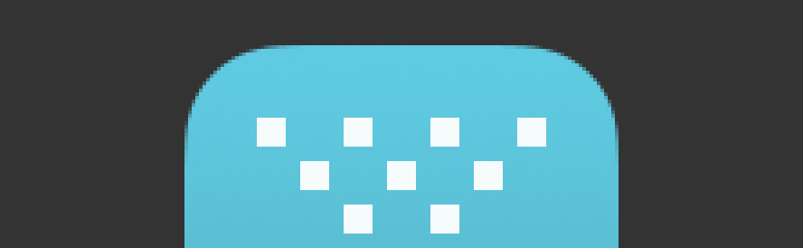

# Bitmap vs vector scaling

There are different methods that can be used to resize icon artwork. Bitmap scaling is usually more convenient, but it produces worse results.

### Bitmap scaling

Bitmap scaling takes the final image result — a grid of pixels — and tries as best as possible to map the source grid to the destination grid. There are many techniques for doing this, and some incorporate additional processing, like sharpening. Bitmap scaling can end up with obvious scaling artefacts, as the halos around the light squares show above.

Bitmap scaling isn’t a good way to scale icon artwork. The `Smart Objects (for preview only)` in the Photoshop app icon templates use Smart Objects, and [Smart Objects bitmap scale](https://bjango.com/articles/smartobjects/), so I don’t recommend using them for final production assets.

-----

### Vector scaling

Vector scaling takes the original layers and groups of vector objects — the rectangles, ellipses and freeform paths — and scales their positions and sizes. Once the new sizes have been calculated, each layer of the artwork is rendered again at the new size, then composited together. This is the preferable technique when scaling icon artwork, or anything that it predominately vector-based.

-----

### Hand tweaked vector scaling

For the best results, vector scaled artwork may still require additional tweaks for each icon size, especially for smaller icons. This is because the position and size of elements may not fall on exact pixel boundaries, resulting in blurry edges, especially for horizontal and vertical lines.

Editing your icon’s shapes so they fall on exact pixel boundaries can be a time consuming process, but it does yield better results. For the icons sizes you really care about, I recommend vector scaling, then hand tweaking.
