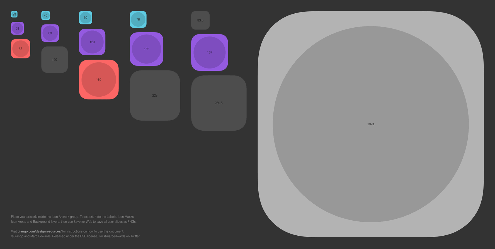
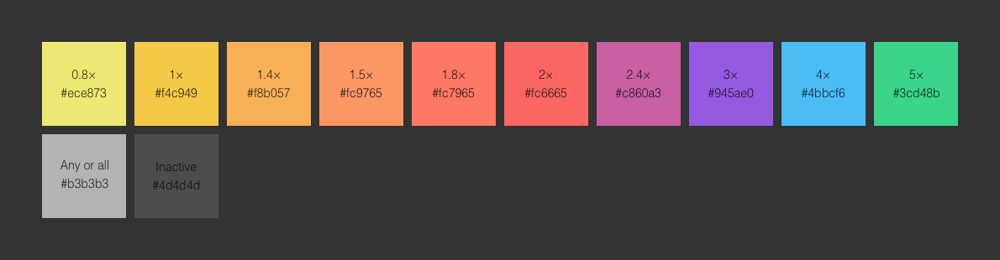
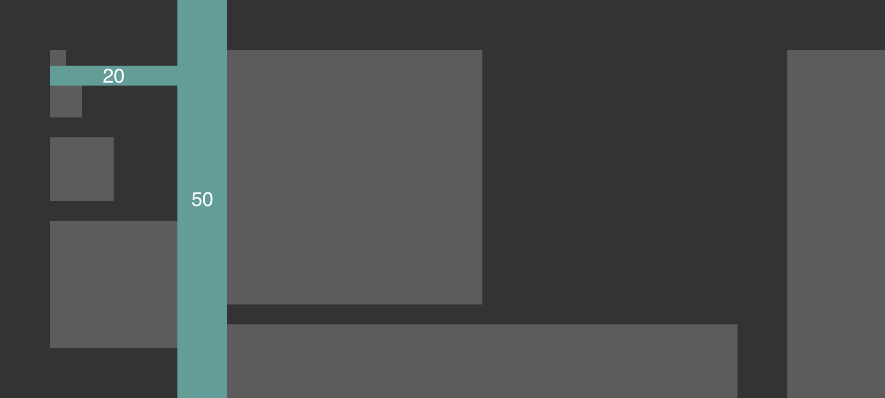

# Bjango App Icon Templates style guide

This style guide is intended for template creators, not necessarily for those using the templates. It should help ensure consistency across all app icon templates, where possible. Platform requirements may mean different templates require different approaches, but the information below should set some sensible defaults.

The [iOS app icon template](https://github.com/bjango/Bjango-Templates/blob/master/Photoshop/App%20Icon%20-%20Apple%20iOS.psd) shown above (with the `Labels` group turned on) is a good example of the app icon templates, because it includes all the recommended and optional layers.

-----

### Recommended layers

An `Icon Artwork` layer or group should be present to denote where artwork is to be placed. If it makes sense, folders for each icon size should also be included with basic example artwork. This layer or group should be unlocked.

Slice layers used in Sketch should be locked, to make it easier to select artwork layers, and to make it more difficult to accidentally edit them.

Where possible, a `Labels` group should denote icon areas and icon sizes. Icon areas should be coloured according to their [scaling factor](https://github.com/bjango/Bjango-Templates/blob/master/Help/Style%20Guide.md#scaling-factors). If possible, the `Labels` group should be locked. Text labels to indicate the size of each icon should be provided, using Helvetica Light, 14pt/22pt, `#000000` at 80% opacity. The text labels should indicate the size of the icon in pixels (not points or pt or dp or dip). If the icon is so small that text doesn’t fit, create it, but hide the layer.

If the platform masks icons, provide a `Icon Masks` group that masks non-icon areas to `#333333`.

A base `Background` layer that fills the entire canvas with `#333333` should also be provided (it allows for easy testing on different backgrounds, as well as providing a neutral starting point).

If the design tool supports it, all the non-`Icon Artwork` layers and groups can be coloured. In Photoshop and Illustrator, they’re violet.

-----

### Optional layers

In some cases, it might be nice to provide additional layers to indicate common icon element sizing. As an example, the OS X app icon template shows the common circular icon size (and a size that perfectly scales to the required icon sizes). These should probably be included in the `Labels` layer or group, and set to `#000000` at 15% opacity.

-----

### Scaling factors

Where sensible to do so, icon labels should be coloured according to their screen pixel density scale factor.

Here’s the corresponding HEX values:

- 1.0×: `#5fcbe2` _(base scale, mdpi, non-Retina)_
- 1.25×: `#539eea` _(whhhhyyyy?!)_
- 1.5×: `#4a79f1`
- 2.0×: `#945ae0` _(xhdpi, Retina, @2x)_
- 3.0×: `#fc6665` _(xxhdpi, @3x)_
- 4.0×: `#f39e50` _(xxxhdpi)_
- 5.0×: `#f8ef62` _(reserved for the future)_
- Any or all: `#b3b3b3`
- Inactive: `#4d4d4d`

When it is not appropriate to use a scale colour, use the `Any or all` grey. When an icon size is worth including, but isn’t part of the required sizes for the platform, it should be indicated with the `Inactive` colour.

-----

### Spacing

Icons can be grouped in any way that makes sense, but if possible increase base icon size on the X axis and increase screen density on the Y axis. Spacing should be 20px for grouped icons and 50px for between groups. Document padding should be 50px. The iOS template is a good example of this.

-----

### Document DPI

Documents should be set up as 72dpi, were possible. There’s a few reasons for this, including more predictable behaviour when moving layers between Photoshop documents.

-----

### Document names

The document names use a format of: `What It Is` in Title Case, then ` - ` (space, dash, space), then the `Manufacturer And Platform` in Title Case. If additional versions are needed, they can be shown in parenthesis.

Some examples:

- `App Icon - Apple iOS`
- `App Icon - Apple watchOS`
- `App Icon - Google Android`

Sometimes you may have to wing it a little:

- `Favicon - Web`

-----

### Platform naming order

Platform names should be in alphabetical order, when listed with their full names (as per the [document names](https://github.com/bjango/Bjango-Templates/blob/master/Help/Style%20Guide.md#platform-naming-order) above).

-----

### Exporting and filenames

Where possible, slices should be used for exporting in Photoshop, Illustrator, Affinity Designer and Sketch.

Icons that require overlapping artwork may use a different strategy. The Apple TV (tvOS) template is an example of this — the parallax nature of the icons required Generator-style exporting for Photoshop, but slices in Sketch.

Filenames for exporting should be lowercase letters with dashes (lisp-case), unless platform requirements state otherwise. Use `icon-512` as the export name (where `512` is the icon size). Some icons need correct suffixes. For example, `icon-512` might need to be `icon-256@2x`.

When it’s ideal for a folder to be created as part of the export, a hash (“#”) should be used in the filename. This is so Hazel and other tools can be used to automate the process of renaming and moving the files into folders. A Hazel rule to do this is part of [Bjango Actions](https://github.com/bjango/Bjango-Actions). The Android icons demonstrate this, converting `drawable-hdpi#icon` into `drawable-hdpi/icon.png`.

-----

### Colour management

Unless there’s a really good reason not to, documents are set up as sRGB. When designing for mobile, you should always preview on the target device(s) when choosing final colours. When designing for web, you should preview in multiple browsers, because they can have different colour management behaviour.

[Skala Preview](https://bjango.com/mac/skalapreview/) and other tools can be used for device preview.