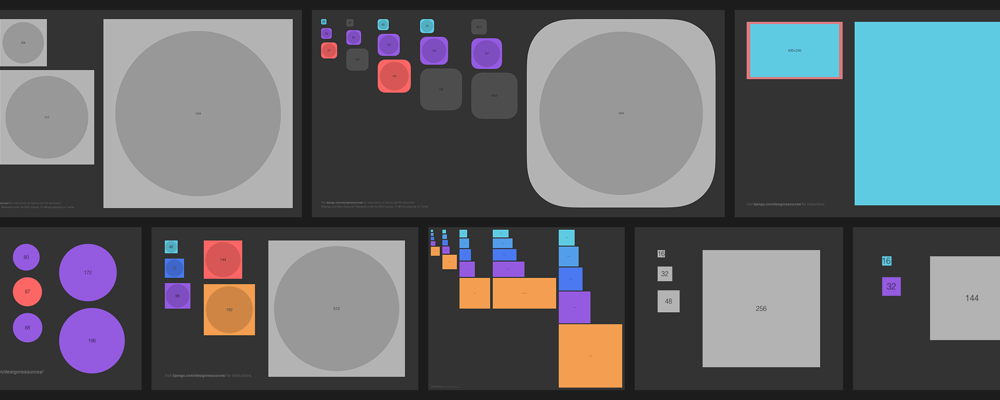

# Bjango App Icon Templates

The [Bjango App Icon Templates](https://bjango.com/designresources/) are a comprehensive set of app icon templates for Photoshop, Illustrator, Sketch, and Affinity Designer. The templates cover Android, iOS, macOS, Apple TV (tvOS), Apple Watch (watchOS), iMessage, Windows, Windows Phone and web favicons. Where possible, they’re set up to automate exporting final production assets. All free and open source, released under the [BSD license](https://github.com/bjango/Bjango-Templates/blob/master/Help/License.md).

**Download:** **[Bjango App Icon Templates](https://github.com/bjango/Bjango-Templates/archive/master.zip)** — 1.9 ([version history](https://github.com/bjango/Bjango-Templates/blob/master/Help/Version%20History.md))

-----

### Help

- [Adding your artwork](https://github.com/bjango/Bjango-Templates/blob/master/Help/Help.md#adding-your-artwork)
- [Using the Photoshop templates](https://github.com/bjango/Bjango-Templates/blob/master/Help/Help.md#using-the-photoshop-templates)
- [Using the Illustrator templates](https://github.com/bjango/Bjango-Templates/blob/master/Help/Help.md#using-the-illustrator-templates)
- [Using the Sketch templates](https://github.com/bjango/Bjango-Templates/blob/master/Help/Help.md#using-the-sketch-templates)
- [Using the Affinity Designer templates](https://github.com/bjango/Bjango-Templates/blob/master/Help/Help.md#using-the-affinity-designer-templates)
- [Using other design tools](https://github.com/bjango/Bjango-Templates/blob/master/Help/Help.md#using-other-design-tools)
- [iOS, tvOS and other icon masks](https://github.com/bjango/Bjango-Templates/blob/master/Help/Help.md#ios-tvos-and-other-icon-masks)
- [Bitmap vs vector scaling](https://github.com/bjango/Bjango-Templates/blob/master/Help/Scaling.md)
- [Hashes in export names](https://github.com/bjango/Bjango-Templates/blob/master/Help/Help.md#hashes-in-export-names)
- [Compressing images](https://github.com/bjango/Bjango-Templates/blob/master/Help/Help.md#compressing-images)
- [Platform icon sizes](https://github.com/bjango/Bjango-Templates/blob/master/Help/Icon%20Sizes.md)
- [Style guide](https://github.com/bjango/Bjango-Templates/blob/master/Help/Style%20Guide.md)
- [Colour management](https://github.com/bjango/Bjango-Templates/blob/master/Help/Help.md#colour%20management)
- [Tips](https://github.com/bjango/Bjango-Templates/blob/master/Help/Help.md#tips)
- [Version history](https://github.com/bjango/Bjango-Templates/blob/master/Help/Version%20History.md)
- [License](https://github.com/bjango/Bjango-Templates/blob/master/Help/License.md)
- [Feedback and future plans](https://github.com/bjango/Bjango-Templates/blob/master/Help/Help.md#feedback-and-future-plans)

An overview of some common layers included in the templates:

`Labels` — Indicate icon sizes and scale factor.  
`Icon Masks` — In cases where the OS masks icons, this group fills non-icon areas, showing you how icons will be masked.  
`Icon Artwork` — Place your icon artwork here.

In some cases, all layers and groups except the `Icon Artwork` group will need to be hidden before exporting. For most templates, exporting is set up using slices. Short questions can be sent to [@marcedwards](https://twitter.com/marcedwards) or [@bjango](https://twitter.com/bjango) on Twitter. More verbose questions can be sent via the [Bjango contact page](https://bjango.com/contact/). If you notice any errors, please let me know.

-----

### Legal

Apple, iPhone, iOS, tvOS, Apple TV and Apple Watch are trademarks of Apple Inc., registered in the U.S. and other countries. Microsoft and Windows are trademarks of Microsoft Corporation Inc., registered in the U.S. and other countries. Google and Android are trademarks of Google Inc., registered in the U.S. and other countries.

```
              :::::::::     :::::::       ::::        ::::    :::     ::::::::      :::::::: 
             :+:    :+:        :+:      :+: :+:      :+:+:   :+:    :+:    :+:    :+:    :+: 
            +:+    +:+        +:+     +:+   +:+     :+:+:+  +:+    +:+           +:+    +:+  
           +#++:++#+         +#+    +#++:++#++:    +#+ +:+ +#+    :#:           +#+    +:+   
          +#+    +#+        +#+    +#+     +#+    +#+  +#+#+#    +#+   +#+#    +#+    +#+    
         #+#    #+#    #+# #+#    #+#     #+#    #+#   #+#+#    #+#    #+#    #+#    #+#     
        #########      #####     ###     ###    ###    ####     ########      ######## 
```
