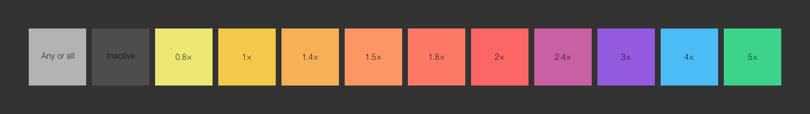

# Style guide

TODO: Errors and omissions are marked with “TODO”. Fix these before release!

### Suggested layers

Platform requirements may mean different templates are different, but where possible, a `Labels` group should denote icon areas and icon sizes. Icon areas should be coloured according to their scale factor (more info below). If possible, the `Labels` group should be locked.

If the platform masks icons, provide a `Icon Masks` group that masks non-icon areas to `#333333`.

A base `Background` layer that fills the entire canvas with `#333333` should also be provided (it allows for easy background colour editing as well as providing a good starting point).

### Scaling factors

Where sensible to do so, icon labels should be coloured according to their screen density scale factor.

TODO: Image of scale factors and their HEX values.

### Spacing

Icons can be grouped in any way that makes sense, but if possible increase base icon size on the X axis and increase screen density on the Y axis. Spacing should be 20px for grouped icons and 50px for between groups. Document padding should be 50px. The iOS template is a good example of this.

### Exporting and filenames

Where possible, slices should be used for exporting in Photoshop, Illustrator and Affinity Designer. Where possible, artboards should be used for exporting in Sketch.

Icons that require overlapping artwork may use a different strategy. The Apple TV template is an example of this — the parallax nature of the icons required Generator-style exporting for Photoshop and TODO for Illustrator and Affinity Designer.

Filenames for exporting are lowercase letters with dashes (lisp-case), unless platform requirements state otherwise. Unless the platform dictates filename or there a sensible reason to not do so, use `icon-512` as the export name (where `512` is the icon size). Some icons need correct suffixes. For example, `icon-512` might need to be `icon-256@2x`.

For design tools that don’t support creating folders as part the export, a hash (“#”) should be used in the filename. This is so Hazel and other tools can be used to automate the process of renaming and moving the files into folders. A Hazel rule to do this is part of [Bjango Actions](https://github.com/bjango/Bjango-Actions). The Android icons demonstrate this, converting `drawable-hdpi#icon` into `drawable-hdpi/icon.png`.
